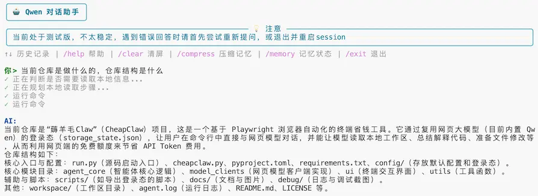
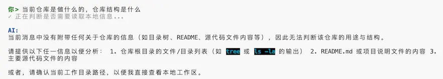

# 薅羊毛Claw

你还在为 token 额度见底而烦恼吗？你还在为昂贵的上下文费用默默流泪吗？你的每个需求真的都需要仓库级智能体全量出击吗？薅羊毛Claw 给你一种更“精打细算”的选择：用 Playwright 复用网页模型登录态，把终端对话、工作区读取和受控文件修改搬进命令行；该你拍板的地方拍板，该 Web 端出力的地方出力，能多薅一根羊毛，就绝不多烧一点 token。

> **More Artificial, Less Intelligence; More Savings Grow, Less Tokens Flow.**

| 正常薅羊毛 | 偶尔也会失手 |
| --- | --- |
|  |  |

**在这里你可以：** 在没有 API Key 时和网页模型在终端里对话；读取当前工作区；做轻量代码分析、总结和定位；准备小修小补的文件修改。

**但臣妾做不到：** 专业代码 Agent 的完全替代品，也不适合大规模无人值守改仓库、依赖稳定 API SLA 的生产流程，或处理敏感凭据和私密数据。

## 功能演示

想看看实际效果？这里是一个用 CheapClaw 开发个人主页的完整运行记录。
[查看demo →](docs/demo.md)

## 环境要求

- Python `>=3.10`
- Chromium / Playwright 浏览器运行环境
- 一个可用的网页模型账号登录态

推荐使用虚拟环境：

```bash
python -m venv .venv
source .venv/bin/activate
```

## 安装

开发模式安装：

```bash
pip install -e .
playwright install chromium
```

或者直接安装依赖后运行源码：

```bash
pip install -r requirements.txt
playwright install chromium
```

## 准备登录态

CheapClaw 会按当前模型客户端读取对应登录态，默认命名规则为 `config/storage_state_<model>.json`。这些文件包含网页登录凭据，请勿提交或分享。

有图形界面的机器上，运行统一登录态导出脚本。安装为 CLI 后使用：

```bash
cheapclaw-export-state --model <model>
```

未安装为 CLI 时，可直接运行源码脚本：

```bash
python -m cheapclaw.scripts.export_state --model <model>
```

脚本会打开浏览器。你可以用目标网页支持的网页登录方式完成登录；成功后会导出对应模型的 `config/storage_state_<model>.json`，并使用 `config/login_profile_<model>` 作为临时浏览器 profile（模型实现可使用兼容命名）。

如果开发机没有图形界面，请在本地电脑导出对应模型的 `storage_state_<model>.json`，再上传到开发机项目的 `config/` 目录。

## 快速开始

安装为 CLI 后：

```bash
cheapclaw
```

源码方式推荐：

```bash
python -m cheapclaw
```

也可使用保留的便捷入口：

```bash
python run.py
```

常用参数：

```bash
cheapclaw --headed                 # 有头浏览器，便于观察登录或前端交互
cheapclaw --workspace-root /path/to/project
cheapclaw --model <model>              # 选择模型 (deepseek / qwen，默认 deepseek)
cheapclaw --storage-state /path/to/storage_state_xxx.json
cheapclaw --config /path/to/default_config.json
cheapclaw --cleanup-session          # 退出时清理本次创建的网页会话（当前仅 DeepSeek 支持）
```

如果登录态缺失或失效，CheapClaw 会在 UI 中给出醒目提示，并以未登录模式 fallback；但该模式很可能无法正常完成模型交互。

## 内置命令

在对话界面输入：

| 命令 | 说明 |
| --- | --- |
| `/help` | 查看帮助 |
| `/clear` | 清屏 |
| `/compress` | 手动压缩当前会话记忆 |
| `/memory` | 查看记忆状态 |
| `/keyinfo` | 查看持久化关键信息（`set/del/get` 子命令管理） |
| `/exit` | 保存并退出 |

## 配置

默认会读取当前目录的 `config/default_config.json`；如果不存在，会回退到项目内置默认配置。主要配置项包括：

- `browser.headless`：是否无头运行，默认 `true`。
- `browser.storage_state_path`：自定义登录态路径；为空时使用当前模型客户端默认登录态路径。
- `agent.max_text_chars`：超过该长度时启用文件发送。
- `agent.tools.*`：受控命令白名单、确认回复、输出截断等工具策略。
- `memory.*`：会话上下文预算和压缩阈值。

## 本地文件

运行后会产生一些本地状态文件：

- `config/storage_state_*.json`：各模型网页登录态，敏感文件。
- `.cheapclaw/`：CLI 历史、上传缓存、会话记忆归档。
- `debug/`：日志和调试截图。

这些文件已在 `.gitignore` 中忽略。

## 注意事项

- 不同模型使用各自的登录态文件；新增模型时应遵循 `storage_state_<model>.json` 的命名规则。
- 当前版本仍不稳定，网页状态、选择器变化、登录态过期都可能导致异常；遇到错误时可以先重启 session，或换一种问法重新提问。
- CheapClaw 依赖网页 DOM 和交互流程；网页改版可能需要更新选择器。
- 未登录 fallback 只保证程序不立刻退出，不保证模型交互可用。
- 记忆压缩会通过当前网页模型生成摘要，因此可能产生一次可见的网页交互。
- `storage_state_*.json` 等同于网页登录凭据，请像对待 cookie 一样保护它们。

## 开发

开发文档位于 `docs/guides/`：

| 文档 | 说明 |
| --- | --- |
| [架构概览](docs/guides/architecture.md) | 项目结构、数据流、模块职责与通信关系 |
| [记忆系统](docs/guides/memory.md) | 三层分层记忆、BM25 检索、自动压缩与 session 管理 |
| [终端工具系统](docs/guides/tools.md) | 命令安全策略、受控执行、file replace 工作流与 checkpoint |
| [新增网页模型 Client](docs/guides/add-client.md) | 接入新网页模型网站的完整指南 |

<details>
<summary>版本更新记录</summary>

### 0.1.0

- 增加 `cheapclaw` CLI 和模型登录态导出 CLI。
- 支持 Qwen 网页模型客户端接入。
- 使用 `storage_state_<model>.json` 复用登录态，登录态异常时保留未登录 fallback。
- 加入配置文件、受控工具策略和会话记忆归档。
- 终端显示略显潦草。
- 早期版本偶有抽风，重启 session 或重新提问通常是很实用的民间疗法。

### 0.2.0

- 新增 DeepSeek 网页模型客户端支持（`--model deepseek`）。
- CSS 选择器外部化为 YAML 配置，新增异常层次结构和 `AgentClient` Protocol 接口。
- 终端命令系统完善（扩展白名单、修复误拦截）；记忆系统升级（jieba 分词、更大上下文预算）。
- 新增开发文档：架构概览、记忆系统、终端工具、新增 Client 指南。
- 扩展单元测试覆盖，减少薅羊毛过程中翻车的概率。

### 0.3.0

- 迁移到 `cheapclaw/` 单一顶层包结构，正式入口改为 `cheapclaw.cli:main`，并保留 `python run.py` 作为源码便捷入口。
- 重写会话记忆持久化流程，减少每轮对话写盘，并改进 session 归档、摘要压缩和关键信息检索。
- 修复结构化 JSON 回复解析，增强对网页渲染代码块、控制字符和混合文本回复的兼容性。
- 优化本地工具分路和文件修改触发逻辑：保持 Web 模型路由优先，同时让本地文件读取、写入和 `file replace` 工作流更稳定。
- 拆分文本处理工具模块，移除旧 `text_helpers` 聚合入口，按 Markdown、生成文件清洗、结构化回复解析等职责组织代码。
- 更新 demo 截图与文档说明，并继续补充单元测试覆盖。

</details>
